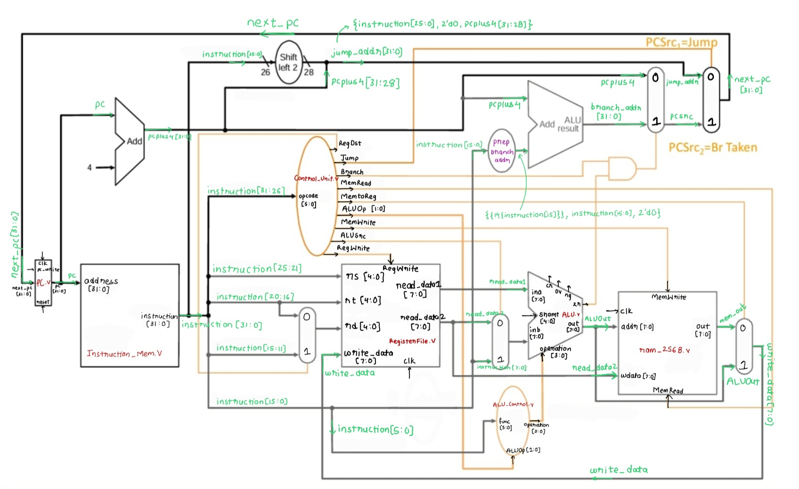

# 8 Bit Microprocessor

* Select [dev](https://github.com/ItsDhananjayDhumal/8bit_Microprocessor/tree/dev) branch for single cycle microprocessor
* Select [pipeline](https://github.com/ItsDhananjayDhumal/8bit_Microprocessor/tree/pipeline) branch for pipelined version of single cycle microprocessor
* Select [jrjal](https://github.com/ItsDhananjayDhumal/8bit_Microprocessor/tree/jrjal) branch for pipelined microprocessor with JSR and stack implemented in hardware
* Click [here](https://github.com/Gurupranav-tech/assembler-soc25) for compiler made for this 8 bit microprocessor 

All refernece documents are in this [drive folder](https://drive.google.com/drive/folders/1Xs3oDFEjL9iQ51fppOAhW1H2Fd3vk4z2). Use IIT Indore's institute email to access.

---

## Single Cycle (not pipelined)

The processor is completely functional. No bugs were found after rigorous testing. Complete ISA is [here](https://gamma.app/docs/ISA-6oy34bgiz7x9q7z). Microarchitecture is shown above.

---

## Pipelining
Check [pipeline branch](https://github.com/ItsDhananjayDhumal/8bit_Microprocessor/tree/pipeline) for pipelined version of single cycle microprocessor
> * Pipeline registers (IF/ID, ID/EX, EX/MEM, MEM/WB) implemented.
> * Forwarding Unit implemented
> * Register File changed to account for data hazard
> * Hazard Detection Unit done
> * Branch Prediction Unit with Branch Prediction Forwarding Unit done

** Pipelining done. Check [pipeline branch](https://github.com/ItsDhananjayDhumal/8bit_Microprocessor/tree/pipeline) for code.

---
## JSR and Stack
For special purpose applications, we plan on adding stack functionalities and JSR through hardware. Check it out in the [jrjal branch](https://github.com/ItsDhananjayDhumal/8bit_Microprocessor/tree/jrjal)
> * JSR implemented (adder jal and jr, that work without any hazards)
> * Stack remaining
---

## Compiler and Assembler
Assembler is done, working on compiler. Ckeck it out [here](https://github.com/Gurupranav-tech/assembler-soc25)
